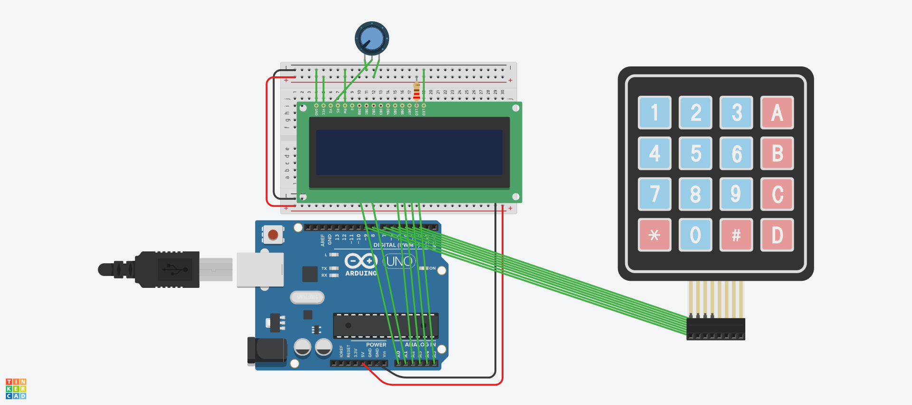

# Arduino Calculator 🧮

## Description
A simple calculator built using an Arduino Uno. It can perform basic mathematical operations using a 4x4 matrix keypad for input and a 16x2 LCD screen to display the calculations and results. 

## Components Used
* Arduino Uno R3
* 16x2 LCD Display
* 4x4 Matrix Keypad
* 10k Ohm Potentiometer (for LCD contrast)
* Breadboard and jumper wires

## Features
* Digits input (0-9)
* Basic math operations (Addition, Subtraction, Multiplication, Division)
* Clear screen functionality

## Circuit / Simulation

This project was simulated and tested using Tinkercad.

## How to Use
1. Wire the components as shown in the circuit image.
2. Upload the Arduino code (`.ino` file) to your Arduino Uno board.
3. Use the keypad to enter your numbers and operations.
